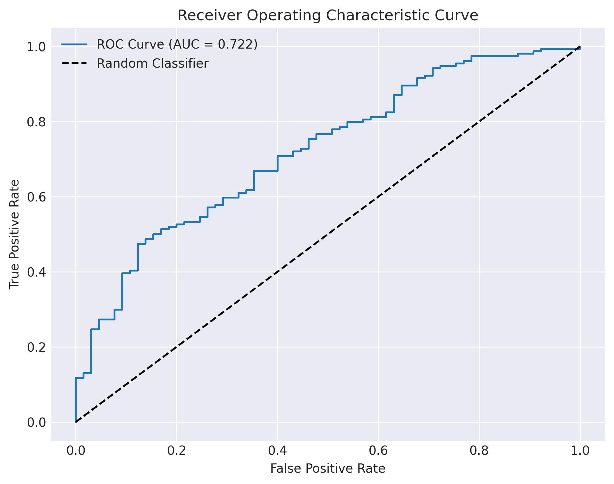
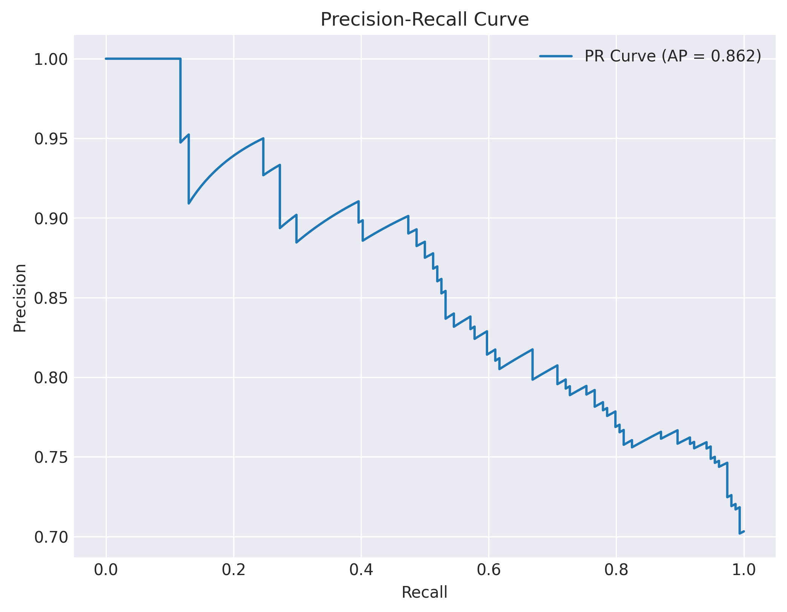
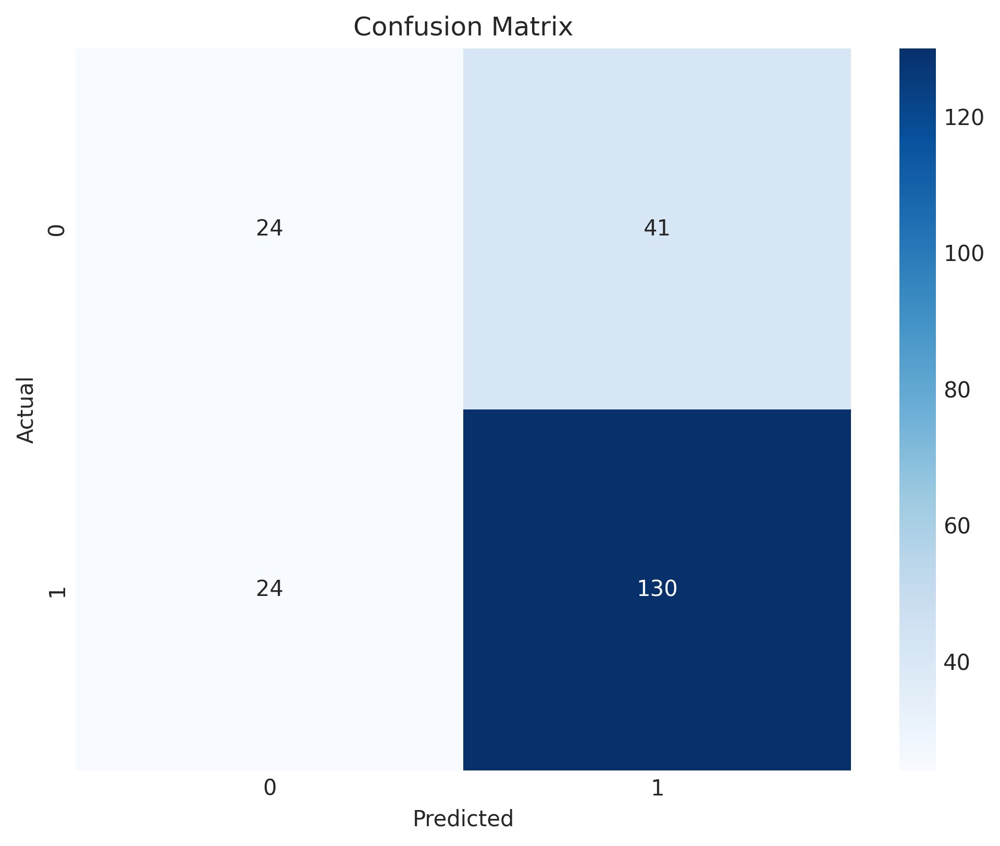
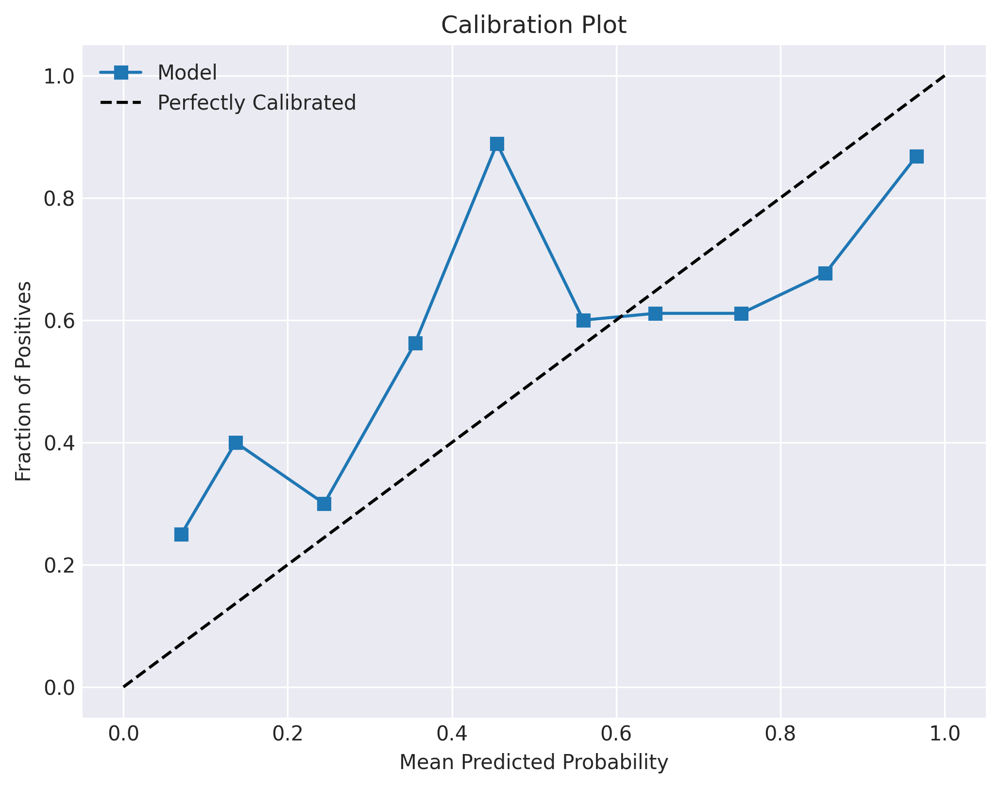
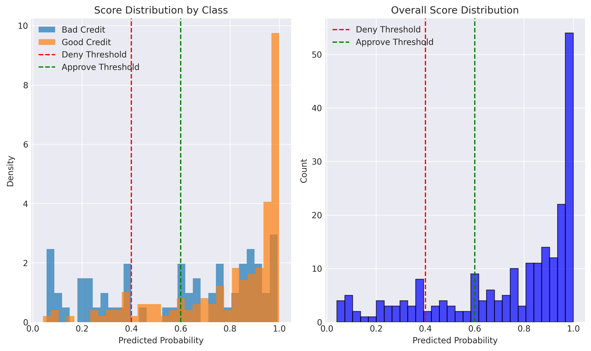
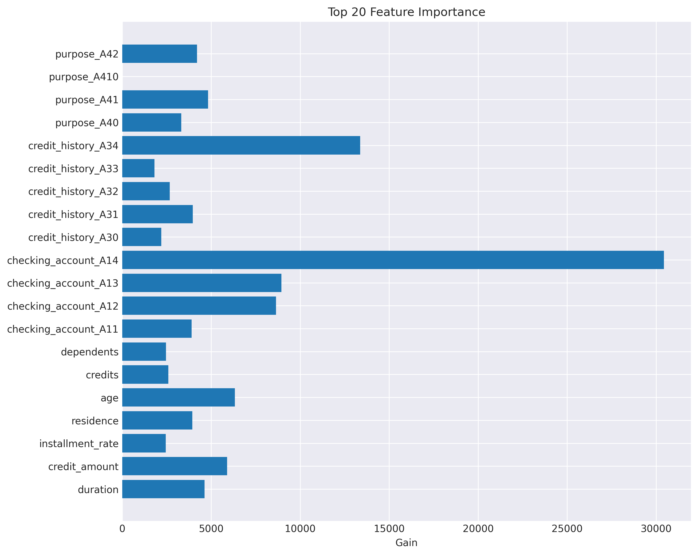

# Credit Risk Model Validation Report
Generated: 2025-07-22 18:37:19

## Model Information
- Model File: tune_best.xgb
- Model Type: XGBoost Binary Classifier
- Test Set Size: 219 samples
- Class Distribution: {1: 154, 0: 65}

## Overall Performance Metrics

### Classification Metrics
- **Accuracy**: 0.7032
- **Balanced Accuracy**: 0.6067
- **Precision**: 0.7602
- **Recall**: 0.8442
- **F1-Score**: 0.8000
- **Matthews Correlation Coefficient**: 0.2356

### Probabilistic Metrics
- **ROC-AUC**: 0.7219
- **Average Precision**: 0.8616
- **Log Loss**: 0.6214

### Confusion Matrix Analysis
- **True Positives**: 130 (Correctly identified good credit)
- **True Negatives**: 24 (Correctly identified bad credit)
- **False Positives**: 41 (Bad credit classified as good)
- **False Negatives**: 24 (Good credit classified as bad)
- **Specificity**: 0.3692
- **Negative Predictive Value**: 0.5000

## Business Impact Analysis

### Decision Distribution
- **Approved (≥0.6)**: 161 (73.5%)
- **Manual Review (0.4-0.6)**: 19 (8.7%)
- **Denied (<0.4)**: 39 (17.8%)

### Bad Rate by Decision Tier
- **Approved Applications**: 22.98% bad rate
- **Manual Review Applications**: 26.32% bad rate
- **Denied Applications**: 58.97% bad rate

## Threshold Analysis

 threshold  accuracy  precision   recall  f1_score
       0.1  0.721461   0.720379 0.987013  0.832877
       0.2  0.726027   0.728155 0.974026  0.833333
       0.3  0.744292   0.750000 0.954545  0.840000
       0.4  0.735160   0.766667 0.896104  0.826347
       0.5  0.703196   0.760234 0.844156  0.800000
       0.6  0.694064   0.770186 0.805195  0.787302
       0.7  0.675799   0.790210 0.733766  0.760943
       0.8  0.657534   0.816000 0.662338  0.731183
       0.9  0.602740   0.868132 0.512987  0.644898

## Model Characteristics

### Classification Report
              precision    recall  f1-score   support

  Bad Credit       0.50      0.37      0.42        65
 Good Credit       0.76      0.84      0.80       154

    accuracy                           0.70       219
   macro avg       0.63      0.61      0.61       219
weighted avg       0.68      0.70      0.69       219

### Recommendations
1. The model shows moderate discriminatory power with an AUC of 0.722
2. The business thresholds effectively separate risk levels with bad rates of 23.0% for approved vs 59.0% for denied
3. Consider adjusting thresholds based on business risk appetite and manual review capacity

## Visualizations

### ROC Curve

### Precision-Recall Curve

### Confusion Matrix

### Calibration Plot

### Score Distribution

### Feature Importance

